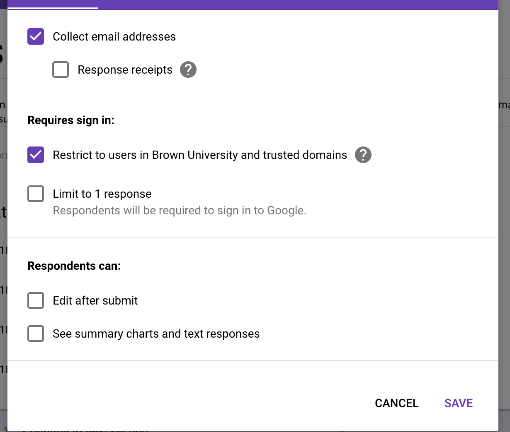
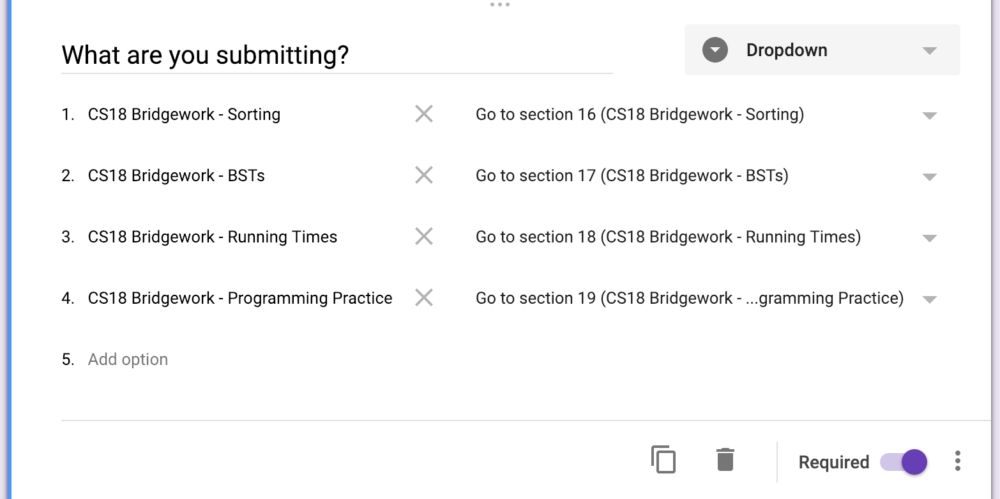
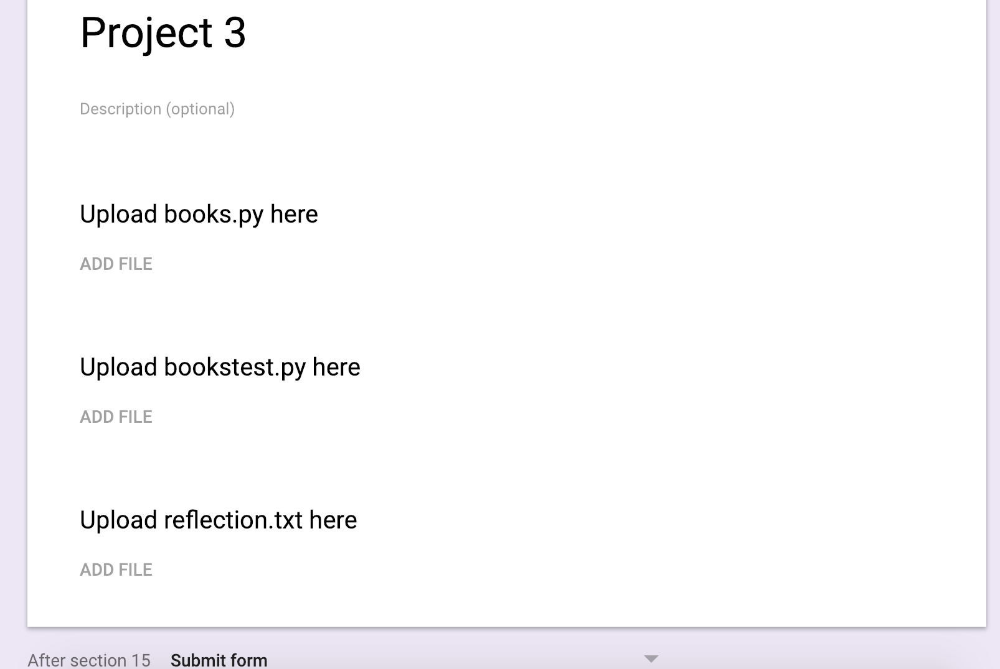
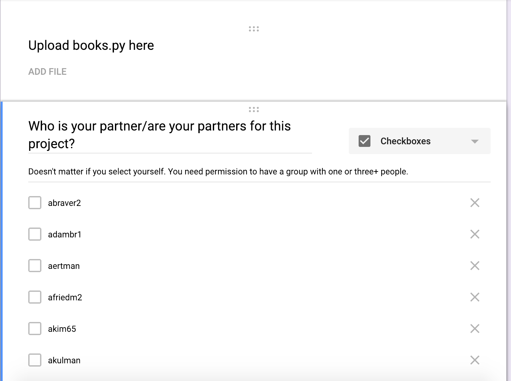

# HTA Relevant Documentation

## Handin
Handin is managed with a single Google Form. The Google Form should dump
responses into a Google Sheet.

### Requirements for the form
- The form should collect student's Brown email addresses, should require
them to sign in, and should not allow editing after submission.

### Assignment selection dropdown
- The form should *not* have an explicit question asking for the student's email
- The form should have one dropdown question asking what the student wants to hand in.
Each option should have a "Go to section x" associated with it so that when the student
selects it, the student will be directed to that section.
- These dropdown options *must match those in `/ta/assignments.json`*. If they don't,
errors will occur. This is case and space sensitive.
- Add and remove dropdown options depending on what students can hand in at any
given time.
- The names of the sections that the dropdown redirect to don't matter; nor do
the names of any questions (only the column they are in matters).

### Normal assignments
- Each assignment should have its own Google Form section. There should be one
File Upload question for each question in `/ta/assignments.json`.
- You may add any other questions you want, but the handin scraper will ignore
those responses (unless you modify `/hta/handin/check_submissions.py`).
- Make sure that "After section x", Submit Form is selected (this will change
every time you add a new section).

### Group assignments
- Group assignments are managed both through the Google Form and `assignments.json`.
For the first assignment in a project, you should collect partner information on the
Google Form by asking an additional "Checkboxes" question. You can print out a list
of the logins of students in the class using `better-members cs-0111student` and
copying that into the Google Form (don't type everything out!).

### Columns for `assignments.json`
- For handin to work properly, the correct Google Sheet columns need to be entered into
`assignments.json`. Whenever you add an assignment, go to the Google Sheet that
the form is dumping submissions into and find the column corresponding to the question.
That column letter should be entered into `assignments.json`.

- For collecting partner data, you should enter the column letter for the checkboxes
question. The handin scripts will parse it properly as long as you have configured
`assignments.json` correctly (which it will be if you use `cs111-add-asgn`).

### Form slowing down too much or handin script taking too long
- If things are getting too cumbersome, you can clear all responses from the Google Form.
If you do this, you must:

0. Turn off handin checking if you have a crontab setup
1. Clear the responses
2. Link the Form to a new Google Sheet
3. Update `/ta/assignments.json` to have the new sheet name, ID, and column ranges
4. Make sure the old responses are not in the new Google Sheet (otherwise everyone
will get duplicate confirmation emails)
5. Clear the submission log in `/hta/handin/submission_log.txt`. This *needs to be last*.
6. Check things are working using cs111-check-handins
7. Re-enable handin checking and you should be all set!

## `assignments.json`
For general configuration, use `ta/assignments.json`. This file contains pretty much all
the configuration for the course.
- What Google Sheet to look for handins in
- Who to send error emails to
- Data for each assignment
    - Which questions go on each assignment
    - When assignments are due
    - Group/project data for each assignment, if relevant
    - Whether grading is anonymous
    - Grading status
    - Information for testsuites for each question
- To add new assignments, run the `cs111-add-asgn` script. You will need to update the
Google Form before doing this so you have all the relevant column numbers available.

For grading, almost everything HTA specific can be done with two commands which are in `htabin`:

## `cs111-asgn-hub`
This script his gives a command line interface with the course and
individual assignments. Use this to:
- Start, finish, and reset grading
- View flagged handins
- Generate and send grade reports
- Manage regrading and de-anonymization
- Generate gradebook
- Generate and send grade summaries
- Manage course data backups
- Reset course data for the next semester

## `asgnipython`
This gives a python interface with the correct permissions
and everything from `hta_classes.py` loaded. the most useful time to use
`asgnipython` is for updating rubrics during grading; see the 
[hta\_classes.py documentation](hta_classes.html) for the classes, variables,
and methods available. the `magic_update` function is how you update rubrics.
you may also want to use `asgnipython` to force the reset of assignment grading
by doing `HTA_Assignment("Assignment Name").reset_grading(True)`.

## Backups
The backup system is not particularly sophisiticated but it is better than nothing.
I mostly recommend using it at the end of the semester to save data in case it is
needed in future years. It will only back up data relevant to the grading app, as
well as anything inside the `/ta/grading/data` directory.

Restoring backups simply makes a new backup, then overwrites all files
with the contents of the backup.

There is currently no way of backing up individual assignments or componenets
of the grading app; if you want this, you need to either implement it into
the grading app or do it by hand in bash.

There is also the `.snapshots` system, which backs up the entire CS department
directory system every ~3 hours. Don't rely on this for long term storage though,
it should generally only be used for recovering files after mistakes were made.
